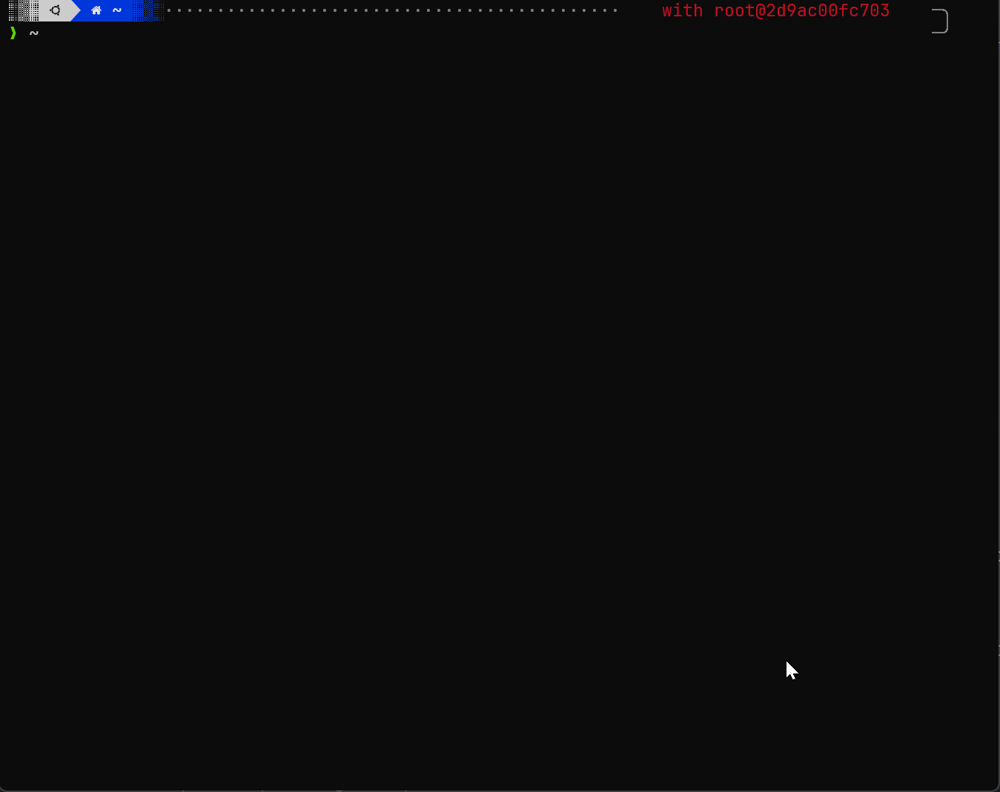

# NeoVim Docker Image

This Docker image contains several NeoVim distributions, including LazyVim, LunarVim, AstroNvim, and more. With this image, you can easily switch between different NeoVim distributions without having to install them individually.

Included Distributions
This Docker image includes the following NeoVim distributions:

LazyVim
LunarVim
AstroNvim
KentVim
NvChadVim
And more!

Each distribution contains its own set of plugins and settings, so you can easily try out different configurations without having to change your local NeoVim installation.

This image also includes:

- python3
- poetry (python package manager)
- nodejs 18
- lazygit
- git
- etc.

## Screenshot



## Build

```bash
docker build -t nvim-playground --build-arg CACHEBUST=$(date +%s) . 
```

## Run

You will be asked to set up the zsh theme [powerlevel10k](https://github.com/romkatv/powerlevel10k) during the initial setup. Afterward, all data will be persisted in a Docker volume called nvim.  

```bash
docker volume create nvim
```

```bash
docker run -e TERM -e COLORTERM -e LC_ALL=C.UTF-8 -v nvim:/root -v /home/kent/.ssh:/root/.ssh -ti nvim-playground 
```


## Reset

```bash
docker rm -f $(docker ps -a -q)
docker volume rm -f nvim
```


